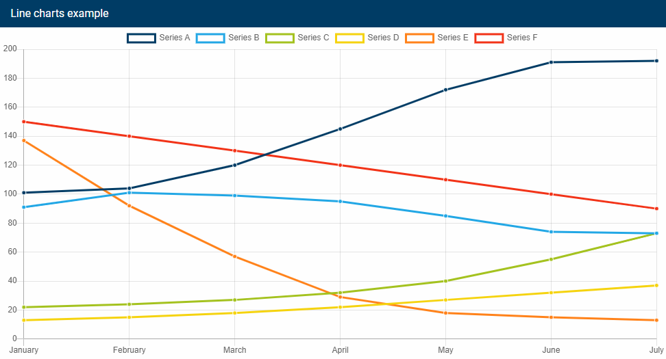
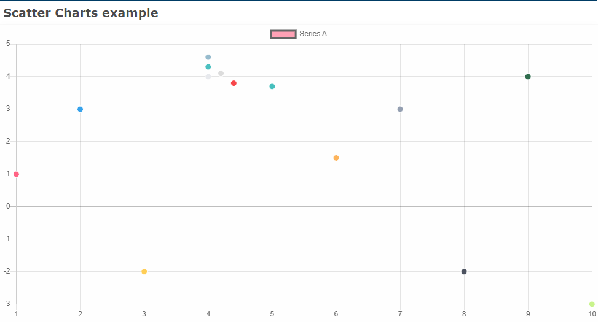

 [](https://badge.fury.io/js/wonka-ui)

# Angular wonka-ui - UI component library using Bulma CSS framework styles
wonka-ui is a front-end/user interface framework written in Angular and Typescript, aimed towards making front-end components and code re-usable within SINTEF Connect.

---

## Versions

| Angular| wonka-ui|
| ------|:------:| 
| >=8.0.0 <9.0.0  | v1.x |

---

Table of contents

* [Chart](#chart)
* * [Line chart](#line-chart)
* * [Pie chart](#line-chart)
* * [Scatter chart](#scatter-chart)
* [Form](#form)
* [Info](#info)
* [Key-value-unit list](#key-value-unit-list)
* [List](#list)
* [Navigation bar](#navigation-bar)
* [Table](#table) 
* [Getting started](#getting-started)
* [Demo application](#demo-application)
* [License](#license)
  
## Chart
#### Line chart
#### Chart.js wrapper for showing 2D line charts.  
  
Include component in html template:
```shell
<lib-chart
    [lineChartItem]="lineChart"
    [id]="'line-1'"
    [class]="'style-class'"
    [header]="'Line chart example'">
</lib-chart>
```
Define chart parameter with dataset(s) in ts file:
```shell
const lineChartDataSets = [{
  data: [101, 104, 120, 145, 172, 191, 192],
  label: 'Series A', lineTension: 0
}, {
  data: [91, 101, 99, 95, 85, 74, 73],
  label: 'Series B', lineTension: 0
}, {
  data: [22, 24, 27, 32, 40, 55, 73],
  label: 'Series C', lineTension: 0
}, {
  data: [13, 15, 18, 22, 27, 32, 37],
  label: 'Series D', lineTension: 0
}, {
  data: [137, 92, 57, 29, 18, 15, 13],
  label: 'Series E', lineTension: 0
}, {
  data: [150, 140, 130, 120, 110, 100, 90],
  label: 'Series F', lineTension: 0
}] as ChartDataSets[];

const lineChartLabels =
  ['January', 'February', 'March', 'April', 'May', 'June', 'July'];

this.lineChart = {
  chartDataSets: lineChartDataSets,
  chartLabels: lineChartLabels
};
`;
```

#### Pie chart
#### Chart.js wrapper for showing 2D pie charts. 
  
Include component in html template:
```shell
<lib-chart
    [pieChartItem]="pieChart"
    [id]="'pie-1'"
    [class]="'style-class'">
</lib-chart>
```
Define chart parameter with dataset(s) in ts file:
```shell
const pieChartDataSets = [105, 100, 95, 90, 85, 80, 75, 70, 65];
const pieChartLabels = [
      'Part 1', 'Part 2', 'Part 3', 'Part 4',
      'Part 5', 'Part 6', 'Part 7', 'Part 8',
      'Part 9'];

this.pieChart = {
  chartData: pieChartDataSets,
  chartLabels: pieChartLabels
};
`;
```

#### Scatter chart
#### Chart.js wrapper for showing 2D scatter charts.  
  
Include component in html template:
```shell
<lib-chart
    [scatterChartItem]="scatterChart"
    [id]="'scatter-1'"
    [class]="'style-class'">
</lib-chart>
```
Define chart parameter with dataset(s) in ts file:
```shell
const scatterChartData = [
  {
    data: [
      { x: 1, y: 1 },
      { x: 2, y: 3 },
      { x: 3, y: -2 },
      { x: 4, y: 4 },
      { x: 4, y: 4.3 },
      { x: 4, y: 4.6 },
      { x: 4.2, y: 4.1 },
      { x: 4.4, y: 3.8 },
      { x: 5, y: 3.7 },
      { x: 6, y: 1.5 },
      { x: 7, y: 3 },
      { x: 8, y: -2 },
      { x: 9, y: 4 },
      { x: 10, y: -3 },
    ],
    label: 'Series A',
    pointRadius: 5,
  },

];
this.scatterChart = {
  chartData: scatterChartData
};
`;
```


## Form
#### Simple generic reactive form example
Include component in html template:  
```shell
<lib-form
    [form]="form1"
    [class]="'style-class'"
    (formSubmitted)="onSubmit($event)"
    (formAborted)="onAbortForm()">
</lib-form>
```
Define form item and onSubmit function in ts file:
```shell
form = {
  name: 'Example form with minimum input ',
  fields: [
    {
      label: 'Main category',
      name: 'simpleCategory',
      type: 'select',
      options: ['Category 1'],
    }, {
      label: 'Name',
      name: 'simpleName',
    }
  ] as FormFieldItem[]
} as FormItem;

onSubmit(formGroup: FormGroup) {
  const values = [];
  Object.keys(formGroup.controls).forEach(key => {
    values.push(key + ': ' + formGroup.controls[key].value);
  });
  alert('Form submitted: ' + JSON.stringify(values, null, 2));
}
```

#### Advanced generic form example  
   
Include component in html template:  
```shell
<lib-form
    [form]="form"
    [class]="'style-class'"
    [showConfirmation]="showConfirmation"
    [showAbortButton]="showAbortButton"
    (formSubmitted)="onSubmit($event)"
    (formAborted)="onAbortForm()">
</lib-form>
```
Define form item and onSubmit/onButtonClicked functions in ts file:
```shell
form = {
      showConfirmation = true;
      showAbortButton = true;
      name: 'Example form with all properties and fields set',
      description: 'This is the description of the form.',
      confirmation: 'This is the confirmation on form submit.',
      submitText: 'Submit form',
      resetText: 'Reset form',
      buttons: [
        {
          id: '1',
          label: 'Button 1',
          class: 'is-primary'
        }, {
          id: '2',
          label: 'Button 2',
          class: 'is-warning'
        }, {
          id: '3',
          label: 'Button 3'
        }
      ] as FormButton[],
      fields: [
        {
          label: 'Main category',
          name: 'categoryAddNew',
          required: true,
          type: 'select',
          options: ['Category 1', 'Category 2', 'Category 3'],
          canCreate: true,
          wide: true,
          info: 'Required field, list of objects, can create new'
        }, {
          label: 'Category',
          name: 'category',
          required: true,
          type: 'select',
          options: ['Category 4', 'Category 5', 'Category 6'],
          canCreate: false,
          info: 'Required field, list of objects, can not create new'
        }, {
          label: 'Name',
          name: 'name',
          required: true,
          type: 'string',
          wide: true,
          info: 'Required field, text, wide, no restrictions'
        }, {
          label: 'Depth',
          description: 'This is the description of the field.',
          name: 'depth',
          required: false,
          type: 'number',
          units: 'mm/sec',
          min: 0,
          expression: '^[\+\-]?([0-9]+([.][0-9]*)?|[.][0-9]+)$',
          info: 'Optional field, numeric, min value zero'
        }, {
          label: 'Size',
          name: 'size',
          required: true,
          type: 'number',
          units: 'mm',
          max: 100,
          expression: '^[\+\-]?([0-9]+([.][0-9]*)?|[.][0-9]+)$',
          info: 'Required field, numeric, max value 100'
        }, {
          label: 'Units',
          name: 'units',
          required: true,
          type: 'number',
          units: 'units',
          min: -100,
          max: 100,
          expression: '^[\+\-]?([0-9]+([.][0-9]*)?|[.][0-9]+)$',
          info: 'Required field, numeric, value between -100 and 100'
        }, {
          label: 'Email',
          name: 'email',
          readonly: true,
          required: true,
          wide: true,
          type: 'string',
          value: 'user@domain.no',
          info: 'Wide field, required, readonly, pre-filled value'
        }, {
          label: 'Color',
          name: 'color',
          wide: true,
          class: 'demo-field',
          type: 'string',
          value: 'Green',
          info: 'Has style class'
        }, {
          label: 'Checkbox 1',
          name: 'checkOne',
          type: 'checkbox',
          info: 'Checkbox'
        }, {
          label: 'Checkbox 2',
          name: 'checkTwo',
          type: 'checkbox',
          checked: true,
          readonly: true,
          info: 'Checkbox readonly'
        }, {
          label: 'No info',
          name: 'noInfo',
          wide: false,
          type: 'string',
        }
      ] as FormFieldItem[]
    } as FormItem;

onSubmit(formGroup: FormGroup) {
  const values = [];
  Object.keys(formGroup.controls).forEach(key => {
    values.push(key + ': ' + formGroup.controls[key].value);
  });
  alert('Form submitted: ' + JSON.stringify(values, null, 2));
  this.showConfirmation = true;
}

onButtonClicked(id: string) {
  alert('Button clicked: ' + id);
}
```

## Info
#### Simple info module with header, content and image.  
   
Include component in html template:  
```shell
<lib-info-panel
    [header]="header"
    [content]="content"
    [class]="'style-class'"
    [imageClass]="imageClass">
</lib-info-panel>
```
Define parameters in ts file:  
```shell
const header = 'The header';
const content =  'The content';
const imageClass = 'image-class';
```

## Key-value-unit list
#### Simple key-value-unit list.  
   
Include component in html template:
```shell
<lib-key-value-unit-list
    [class]="'style-class'"
    [listItem]="listItem">
</lib-key-value-unit-list>
```
Define table item with data in ts file:  
```shell
this.listItem = {
  name: 'Key-value-unit list example',
  items: [
    {
      key: 'Distance',
      value: '100',
      unit: 'meters'
    }, {
      key: 'Temperature',
      value: '23',
      unit: '°C'
    }, {
      key: 'Time',
      value: '45',
      unit: 'seconds'
    }
  ]} as KeyValueUnitListItem;
```

## List
#### Simple list with selectable list items, emits event on item click.  
   
Include component in html template:  
```shell
<lib-list
    [header]="'Multiple select example'"
    [items]="items"
    [class]="'style-class'"
    (itemSelected)="show($event)">
</lib-list>
```
Define items and itemSelected function in ts file:  
```shell
this.items = [{
  id: 'ID1',
  name: 'Item 1',
  path: 'item/',
  description: 'This is item 1',
  header: 'Item 1 Header'
}, {
  id: 'ID2',
  name: 'Item 2',
  path: 'item/',
  description: 'This is item 2',
  header: 'Item 2 Header'
}];

show(event: ListItem) {
  alert('Item clicked: ' + JSON.stringify(event, null, 2));
}
```

## Navigation bar
#### Simple Bulma-based navigation bar.  
   
Include component in html template:  
```shell
<lib-navigation-bar
    [logoClass]="'logo-class'"
    [headerClass]="'header-class'"
    [showSearch]="true"
    [menu]="menu"
    [showLoginMenuItem]="true"
    [dropdownMenu]="dropdownMenu"
    [showLoginButton]="true"
    [user]="user"
    [login]="'Log in'"
    [logout]="'Log out'"
    [logo]="'.assets/img/company-logo.svg'"
    (isAuthorized)="login($event)"
    (searchcriteria)="search($event)">
</lib-navigation-bar>
```
Define parameters, search function and authorize function in ts file:  
```shell
menu: [
  {name: 'Home', path: '/'},
  {name: 'Info', path: '/info-example'},
  {name: 'Forms', path: '/forms-example'},
  {name: 'Charts', path: '/charts-example'},
  {name: 'Containers', path: '/containers-example'},
  {name: 'Navigation', path: '/navigation-example'},
  {name: 'Settings', path: '/settings'}] as MenuElement[];

dropdownMenu: [
    {name: 'Forms example', path: '/forms-example'},
    {name: 'Navigation example', path: '/navigation-example'}
  ]

const user = {
  name: 'Demo User',
  email: 'user@company.no'
} as User;

authorize(login: boolean) {
  alert('Logout button clicked. Login=' + login);
}

search(criteria: string) {
  alert('Search event fired. Criteria=' + criteria);
}
```

## Table
#### Simple table with selectable rows, emits event on row click  
   
Include component in html template:  
```shell
<lib-table
    [table]="tableItem"
    [class]="'style-class'"
    (rowSelected)="showRow($event)">
</lib-table>
```
Define table item with data and rowSelected function in ts file:  
```shell
this.tableItem = {
  tableHeader: 'Table example',
  cols: [{
    columnName: 'Name',
    width: 60
  }, {
    columnName: 'Date',
    width: 25
  }, {
    columnName: 'Status',
    width: 15
  }] as TableColumnItem[],
  data: [
    ['Item 1', '21.12.2019', 'Approved'],
    ['Item 2', '23.12.2019', 'Approved'],
    ['Item 3', '02.01.2020', 'Rejected'],
    ['Item 4', '05.01.2020', 'Cancelled']
  ]
} as TableItem;

showRow(event: string[]) {
  alert('Row clicked: ' + JSON.stringify(event, null, 2));
}
```

## Warning
Library is under active development and may have API breaking changes for subsequent major versions after 1.0.0.

## Getting started
### Step 1: Install `wonka-ui`:

#### NPM
```shell
npm install --save wonka-ui
```
### Step 2: Import the chosen wonka-ui modules:
```js
import { NavigationBarModule, InfoPanelModule } from 'wonka-ui';

@NgModule({
  declarations: [AppComponent],
  imports: [NavigationBarModule, InfoPanelModule],
  bootstrap: [AppComponent]
})
export class AppModule {}
```
## Demo application
The github repository includes a demo application that demonstrates use of the wonka-ui modules.

### Run demo application on default port 4200
```
git clone https://github.com/SINTEF/wonka-ui.git
cd wonka-ui
npm install
cd projects/application/src
npm run start-demo
```
Open demo-app on http://localhost:4200
### Testing
```
npm run test
```

## License
Shield: [![CC BY 4.0][cc-by-shield]][cc-by]

This work is licensed under a [Creative Commons Attribution 4.0 International
License][cc-by].

[![CC BY 4.0][cc-by-image]][cc-by]

[cc-by]: http://creativecommons.org/licenses/by/4.0/
[cc-by-image]: https://i.creativecommons.org/l/by/4.0/88x31.png
[cc-by-shield]: https://img.shields.io/badge/License-CC%20BY%204.0-lightgrey.svg
=======
